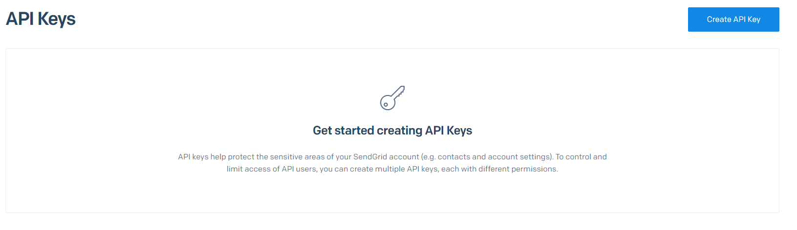

# Postrai.com - Data annotation tool.

This is a [Next.js](https://nextjs.org/) project bootstrapped with [`create-next-app`](https://github.com/vercel/next.js/tree/canary/packages/create-next-app).

## Projects specs
**Web Framework:** This is a [Next.js](https://nextjs.org/) project bootstrapped with [`create-next-app`](https://github.com/vercel/next.js/tree/canary/packages/create-next-app).

**Deployment:** Our live deployment is set to deploy by [Vercel Platform](https://vercel.com/new?utm_medium=default-template&filter=next.js&utm_source=create-next-app&utm_campaign=create-next-app-readme) To make it easy to verify our pushes and good overview with our deployments.

**CDN:** We use a storage container on [DigitalOcean](https://www.digitalocean.com/products/spaces) to store all of our images.

**Database:** As our database server we went with MongoDB to have ease of access to see our data.

## Setting our repository up.

### Cloning the repo
To work on the project, you should start of by cloning the repository
```bash
git clone git@github.com:hrbang/Postrai.com-Dev.git
```

### Downloading MongoDB and setting up database
After you have cloned the repo you should setup a local or online MongoDB Atlas database.

To setup a local MongoDB database, navigate to [MongoDB Community Downloads](https://www.mongodb.com/try/download/community) and install the MongoDB Community server.

<p align="center">
  
</p>

After you have pressed the download button you should get a .MSI installer. 

When you are installing the MongoDB Server you will get a option like this.

<p align="center">
  
</p>

Make sure you have selected the "Run service as Network user" when you are on your local.

After you have you selected the necessary options you will be asked if you want to install MongoDB Compass. Tick that box so it installs it.

Once the dowload is completed you now have a UI for your local MongoDB database, before we can do anything with it we need to download the MongoDB shell to make it work. Navigate to [MongoDB Shell](https://www.mongodb.com/try/download/shell). Select the MongoDB Shell accordion and click download to the right

<p align="center">
  
</p>

Once you have gotten the .MSI installer file open it.

A simple installation where you just need to click next the entire way :)

After you have completed the installation of your MongoDB Shell, open up your Compass to start the MongoDB server.

When you open your Compass you will be greeted with this UI.

<p align="center">
  
</p>

Simply press on "Connect" to start your MongoDB server. 


#### Connecting MongoDB to the project

After you have installed and started the MongoDB server, navigate to the project in your desired IDE, for this example we will be using VSCode.

To set the correct environment variables to work on your local machine, make a copy of the ".env" file and rename the copy to ".env.local" to make sure it wont be pushed to the repository.

Inside of the .env.local it should look like this.

```.env
SPACES_SECRET=
SPACES_ACCESSKEY=
MONGODB_URI=

GOOGLE_CLIENT_ID=
GOOGLE_CLIENT_SECRET=

FACEBOOK_CLIENT_ID=
FACEBOOK_CLIENT_SECRET=

GITHUB_CLIENT_ID=
GITHUB_CLIENT_SECRET=

SENDGRID_API_KEY=
SENDGRID_API_TEMPLATEID_FORGOT=
SENDGRID_API_TEMPLATEID_VERIFY=
SENDGRID_API_URL_FORGOT=
SENDGRID_API_URL_VERIFY=
SENDGRID_API_FROM_EMAIL=
SENDGRID_API_FROM_NAME=

EVERYPIXEL_CLIENT_ID=
EVERYPIXEL_SECRET=
```

To attach your mongoDB Server to your local project, go back to the mongoDB compass app and copy your connection string. The local string should look like this.

```bash
mongodb://localhost:27017/postrai
```

After you have copied it you need to place it in the .env file so it looks like this

```.env
MONGODB_URI=mongodb://localhost:27017/postrai
```

When this is done you have succesfully connected your mongoDB server to your project.

**DISCLAIMER:** The Facebook, Google and Github credentials provider will not work as long you are on localhost with Auth0. So no need to fill those out.

### Creating a Sendgrid Account and Connecting it to the Project.

What we use Sendgrid is to send our forgot password email with a reset link.

Start of by navigating to [Twilio Sendgrid signup](https://signup.sendgrid.com/) and register for a free account. After you have completed the signup you need to fill out some information about yourself, if it suits your needs just select the lowest of the lowest checkboxes.

After you have completed the signup you will be greeted with this Dashboard.

<p align="center">
  
</p>

When you see this dashboard you need to navigate to the "Email API" link in the sidebar and select "Dynamic templates".

What you need to do here is to click on "Create a Dynamic Template".

<p align="center">
  
</p>

Here they will ask you to name your dynamic template, for the example we go with "Test template". But you can name it whatever you want to. After you have given it a name just press "Create".

<p align="center">
  
</p>

When the template have been created you get an accordion with your desired name. Open that and click on "Add a version" to create your first version of a template. OBS. You need to create 2 Dynamic templates, one for Verification and one for Reset Password.

After you get asked to select a design, for the example we go with a blank template to make a custom one.

<p align="center">
  
</p>

After you will be prompted to either select a Design editor or a Code editor, for the example we went with the Code editor.

<p align="center">
  
</p>

Then you will be redirected over to their code editor, to start editing your own email template.

<p align="center">
  
</p>

Here what you need to do is to navigate inside of your project and go to this file

```bash
root > public > email.html
```

and then copy the entire content of the email.html file and paste it inside to get the desired design of the example.

If done correctly you should see something like this

<p align="center">
  
</p>

This is the design of our email templates used for both verification and password reset. The important thing if you decide to create your own template is that you have a ```{action_url}``` inside a button on the email to make sure it works correctly.

After that just hit the "Save" button at the top bar.

You should see a updated version of your first version of the template inside of the accordion now like this.

<p align="center">
  
</p>

After you have created a Dynamic version for both Verification and for Reset Password, you need to take both of the Template ID's and add them to the project in the .env file.

<p align="center">
  
</p>

You should remember to fill out the correct environment variables to the correct one.

```env
SENDGRID_API_TEMPLATEID_FORGOT=d-c21ee7058e884f5da34de231935511f9
SENDGRID_API_TEMPLATEID_VERIFY=d-169fd86450bc46dfba30aaf58bc6a412
```

Remember the above is only how it should look, you should use your own secret key to make it work.

After you have inserted the correct keys it should be good and we then need to go make a sender identity on Sendgrid.

You should see a green bar at the top if you haven't created one yet, if you have that click on the button

<p align="center">
  
</p>

After you should be redirected to the identity create page, so if you see this view, just fill out the required information to make the sender work.

<p align="center">
  
</p>

You should after the create of the sender see this in the view.

<p align="center">
  
</p>

When you have created the single sender, navigate to settings in the sidebar and go into "API Keys"

<p align="center">
  
</p>

Then what you need to do is to click and Create an API Key. Select "Full access" and give the key a name.

<p align="center">
  
</p>

When the key is created you should see this.

<p align="center">
  
</p>

Copy the API key and add it to the .env file.

```env
SENDGRID_API_KEY=YOUR_API_KEY
```

When you have done this you are done on the sendgrid website and only need to fill out a couple of env variables in the project.

```env
SENDGRID_API_URL_FORGOT=
SENDGRID_API_URL_VERIFY=
SENDGRID_API_FROM_EMAIL=
SENDGRID_API_FROM_NAME=
```

- SENDGRID_API_URL_FORGOT you need to set yourself, if you are on localhost it should look like this.

  ```http://localhost:3000/forgot-password?evt```
  
 - SENDGRID_API_URL_VERIFY is the same as above and should look like this.
 
   ```http://localhost:3000/reset-password?rpt```
  
 - SENDGRID_API_FROM_EMAIL is the email you used when you created the single sender
 
 - SENDGRID_API_FROM_NAME is the where the email is sent from, so you can either use a name or a domain name.


### Setting up Everypixel AI Recognition.

To use the pre-trained AI we use to label images you need to navigate to [Everypixel signup page](https://labs.everypixel.com/api/register)
and fill out the profile information.

<p align="center">
  
</p>

After you have registered and logged in you need to fill out the onboarding information to get started

<p align="center">
  
</p>

After you have completed the onboarding you will be redirected the the dashboard of the API. Copy the 2 api keys you see here.

<p align="center">
  
</p>

```bash
EVERYPIXEL_CLIENT_ID=
EVERYPIXEL_SECRET=
```

The two api keys needs to go inside of your .env file at these to variable spots.

Now the EveryPixel API is working and are labeling images being uploaded.

### Setting up DigitalOcean Storage block.

For storage we will be using a DigitalOcean storage block as our CDN.

Start of by navigating to the signup page on digitalocean [DigitalOcean Register](https://cloud.digitalocean.com/registrations/new) And choose one of the preferred signup methods.

<p align="center">
  
</p>

After signing up navigate to create a new project [DigitalOcean new project](https://cloud.digitalocean.com/projects/new?i=3726a1) to store your new space block.

After you have created a new project navigate to create a new Storage block [DigitalOcean Storage block](https://cloud.digitalocean.com/spaces/new?fleetUuid=null&i=3726a1) and fill out what you need in your space.

To start of select where you want your space hosted.

<p align="center">
  
</p>

After that you need to give it a unique sub domain for your space to work as a CDN. Start of by select "Restrict File Listing" to lock your CDN to only your endpoint. After give the CDN a unique name, we recommend just using your project name to make it unique. Select the newly created project and click "Create space"

<p align="center">
  
</p>

Afterwards navigate to "Spaces" on the sidebar to get to this view.

<p align="center">
  
</p>

Click on "Manage Keys" to generate a new Secret API key. Click on "Generate new key" to add a new API key. 

<p align="center">
  
</p>

Give the key a name to generate a key name and secret. After click the checkmark to generate it.

<p align="center">
  
</p>

You should then see a view that looks like this.

<p align="center">
  
</p>

Copy these 2 to and add them to your .env file.

```bash
SPACES_SECRET=
SPACES_ACCESSKEY=
```

Now you have a complete connection to the CDN on your endpoint for your file storage.

## Starting the server

When all of this is complete you are now ready to start your project for the first time.

Start of by navigating inside your folder in the command prompt. When you are inside of the correct folder you need to run this command.

```bash
npm install
```

This command will install all the required packages the project uses.

After this is completed you can then run

```bash
npm run dev
```

This will open a project on
```bash
localhost:3000
```

On this localhost you can see the project and all its files and style.

Congratulations. You now have setup "Postrai" platform.
